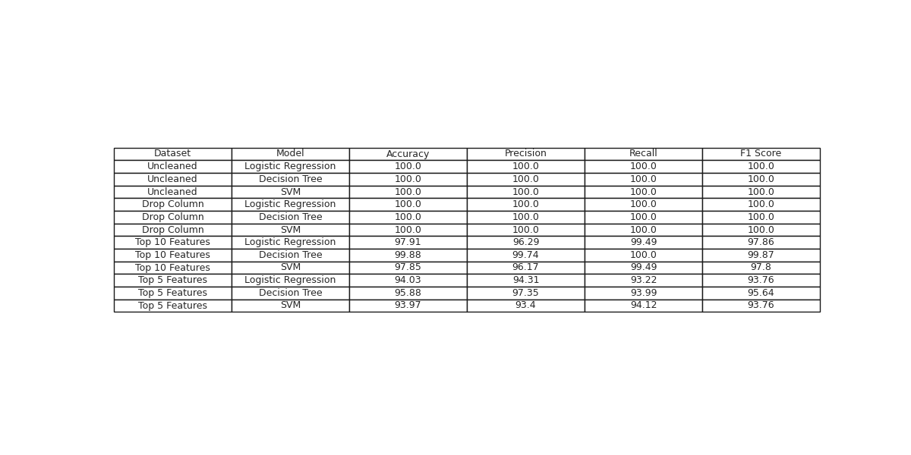

# Machine Learning Midterm

## My package
This is my effort to classify mushrooms

## Results Table


## Overview
The goal of this project is to classify mushrooms as edible or poisonous.  That is not a hugely challenging task as this data set has been well examined in numerour places on the internet.  What I am curious to look at here is the effect of different approaches to data cleaning and  feature selection on the models.  

Here's what I propose to do:

The data will be cleaned in the following ways:
1. Uncleaned as is
2. Remove columns with missing data
3. Run iterations of the model with different combinations of columns removed.  Specifically, I want to try a few statistical methods to determine which columns are most important.  I will use the following methods:
    - Chi-squared
    - Recursive Feature Elimination


The models I will use are:
1. Logistic Regression
3. Decision Tree
4. Support Vector Machine   

The data comes from: https://archive.ics.uci.edu/dataset/73/mushroom 

## Author(s)
Philip Fowler

## Usage
Instructions on how to use your project.
```python3
>>> import mypackage
>>> mypackage.do_stuff()
```

## Metadate from ICU
     1. cap-shape:                bell=b,conical=c,convex=x,flat=f, knobbed=k,sunken=s
     2. cap-surface:              fibrous=f,grooves=g,scaly=y,smooth=s
     3. cap-color:                brown=n,buff=b,cinnamon=c,gray=g,green=r, pink=p,purple=u,red=e,white=w,yellow=y
     4. bruises?:                 bruises=t,no=f
     5. odor:                     almond=a,anise=l,creosote=c,fishy=y,foul=f, musty=m,none=n,pungent=p,spicy=s
     6. gill-attachment:          attached=a,descending=d,free=f,notched=n
     7. gill-spacing:             close=c,crowded=w,distant=d
     8. gill-size:                broad=b,narrow=n
     9. gill-color:               black=k,brown=n,buff=b,chocolate=h,gray=g, green=r,orange=o,pink=p,purple=u,red=e, white=w,yellow=y
    10. stalk-shape:              enlarging=e,tapering=t
    11. stalk-root:               bulbous=b,club=c,cup=u,equal=e, rhizomorphs=z,rooted=r,missing=?
    12. stalk-surface-above-ring: fibrous=f,scaly=y,silky=k,smooth=s
    13. stalk-surface-below-ring: fibrous=f,scaly=y,silky=k,smooth=s
    14. stalk-color-above-ring:   brown=n,buff=b,cinnamon=c,gray=g,orange=o, pink=p,red=e,white=w,yellow=y
    15. stalk-color-below-ring:   brown=n,buff=b,cinnamon=c,gray=g,orange=o, pink=p,red=e,white=w,yellow=y
    16. veil-type:                partial=p,universal=u
    17. veil-color:               brown=n,orange=o,white=w,yellow=y
    18. ring-number:              none=n,one=o,two=t
    19. ring-type:                cobwebby=c,evanescent=e,flaring=f,large=l, none=n,pendant=p,sheathing=s,zone=z
    20. spore-print-color:        black=k,brown=n,buff=b,chocolate=h,green=r, orange=o,purple=u,white=w,yellow=y
    21. population:               abundant=a,clustered=c,numerous=n, scattered=s,several=v,solitary=y
    22. habitat:                  grasses=g,leaves=l,meadows=m,paths=p, urban=u,waste=w,woods=d
            
## Installation
Instructions on how to install your project.
```python3
pip install ucimlrepo
```

```python3
from ucimlrepo import fetch_ucirepo 
  
# fetch dataset 
mushroom = fetch_ucirepo(id=73) 
  
# data (as pandas dataframes) 
X = mushroom.data.features 
y = mushroom.data.targets 
  
# metadata 
print(mushroom.metadata) 
  
# variable information 
print(mushroom.variables) 
```

